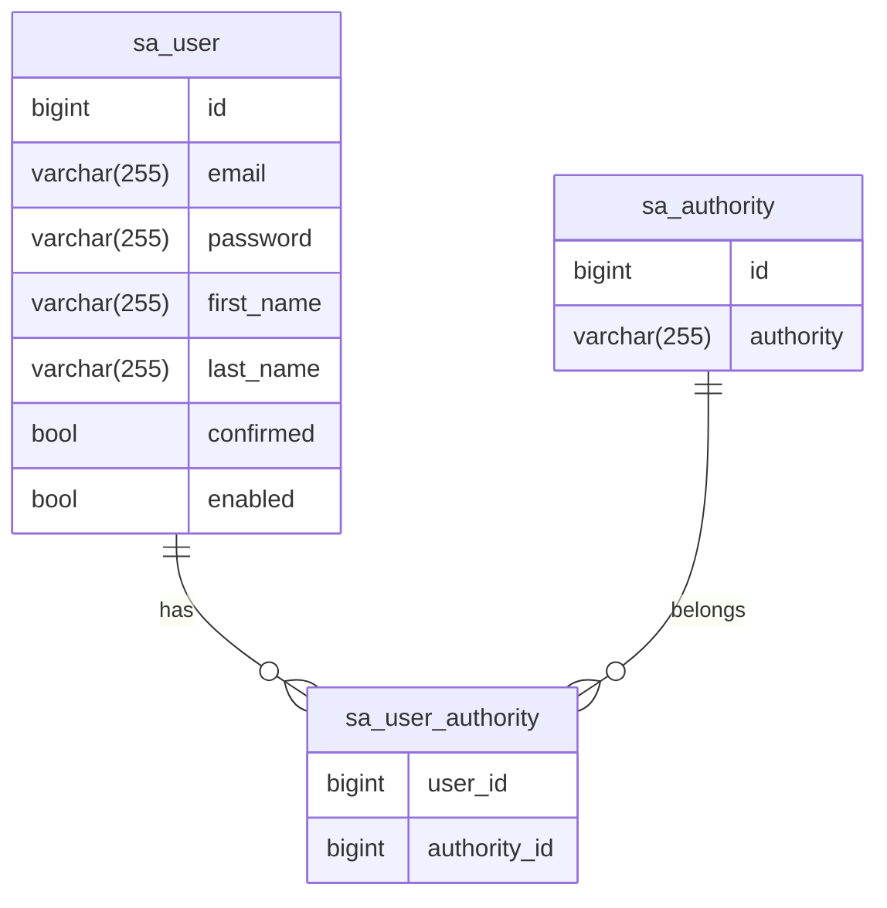

# db

I decided to separate the [database structure definition script](./init.sql) from the code because I want to demonstrate
that this one database can be used with multiple types of backend services.

