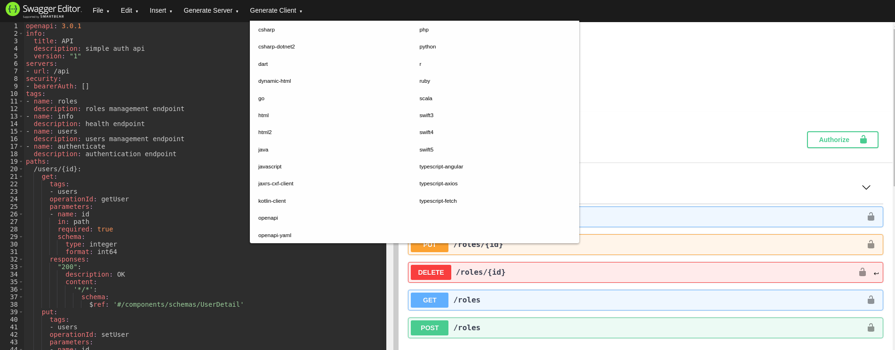

# simple-auth-backend
Simple authentication backend roles and users management api.

## endpoints
Documentation is generated in [OpenApi](https://www.openapis.org/) 3.0 format, you should find it in 
`./target/api-docs.yml` after build. You should use this file for example in [swagger editor](https://editor.swagger.io/)
to generate client code.

## environment variables
|Name|Default value|Description|
|---|---|---|
|SIMPLE_AUTH_PORT|8080|server port|
|SIMPLE_AUTH_CONTEXT_PATH|/api|context path|
|SIMPLE_AUTH_LOG_LEVEL|debug|log level|
|SIMPLE_AUTH_DB_URL|jdbc:postgresql://localhost:5432/app|db url| 
|SIMPLE_AUTH_DB_USER|app|db user| 
|SIMPLE_AUTH_DB_PASS|app|db password| 
|SIMPLE_AUTH_EXPIRATION|1800|jwt expiration in seconds|
|SIMPLE_AUTH_PRIVATE_KEY|*|RSA private key| 
|SIMPLE_AUTH_PUBLIC_KEY|**|RSA public key|

### *
`MIICdQIBADANBgkqhkiG9w0BAQEFAASCAl8wggJbAgEAAoGBAJtoXnsH6Ej7xpuRL9T1kElPWfH64KRjUQU6vRhgQi/z4FD6GncrK5PSjZA14XFiZZVeO6cvivdiQhpMBZqs9xjpiMmmAEBkEXf7MmvObsPuSa2jbLtXTGF8q5SZ83FIfFNwoghPToL9U64InhqBc2G6pbqisk38n14x/Y60/FSLAgMBAAECgYAXSxJ2QF4pqks/gAh6VAA3bMRfh6nqGdTIAuDa6XqiM1yY5pPW7sqOUo3TYrASzZvKQqCQU4jxwXGE/YYNhAVZI5GhUXS8l4m0QFjg7fe0pnLMq7uIUMgU0NUByv2fkZ1E5W/Z/7rJgABT4j56W9KAaJbmRUeYAUCyN7a55nktiQJBANhz5zc5KlWOJtmZ5kq1T7OKdv12JhMllAaL5ksxZk4Z6UUPXxudzTnK1/QyD2be7ySKjhsp6foM4kMPTbvEMyUCQQC3zTgKs29IizFjIvOt+rIESw4im+ojvz7bOFg6L02i+qbFNfMYuPB8Quq0ldR4t4Ujvb91UcjsYDMbfzd7ZLHvAkBAXueqMqP2YZoIKI6mNRmIyWrtoc9c7lYBRGWugvhrzaTj1thv/BPmVf63LpQKAc6YzWPJjEN7C43WZ5y0dHrJAkAwLeghzfU+w9XXUcMkeNGPFImJAuu2IRx95GAkKGAmd6OdkE2/zkKjn/rcCWZfmmOZAdUdEKolY/YhoBBQFQ4bAkAWwe3NoV1+OkJHVF+ECFUGmFfUgh3K5foGHkdrII82CnlSbflLb9ODPTS25XHHXz7ENzXAY2sFjih+lgJ+Mz8x`

### **
`MIGfMA0GCSqGSIb3DQEBAQUAA4GNADCBiQKBgQCbaF57B+hI+8abkS/U9ZBJT1nx+uCkY1EFOr0YYEIv8+BQ+hp3KyuT0o2QNeFxYmWVXjunL4r3YkIaTAWarPcY6YjJpgBAZBF3+zJrzm7D7kmto2y7V0xhfKuUmfNxSHxTcKIIT06C/VOuCJ4agXNhuqW6orJN/J9eMf2OtPxUiwIDAQAB`
