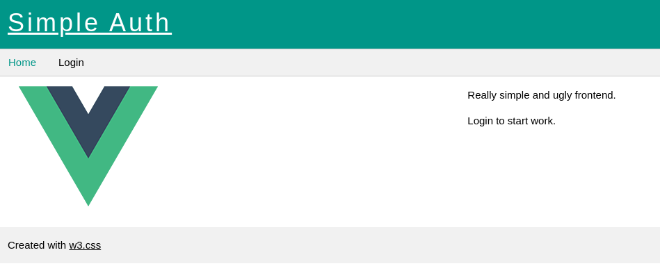
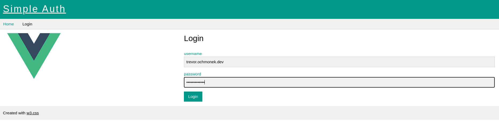
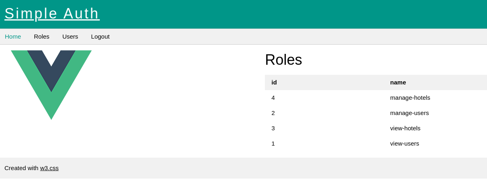
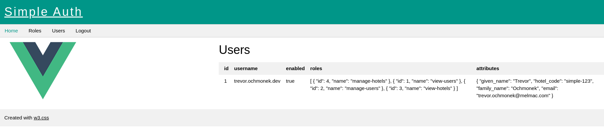

# simple-auth-frontend

Simple authentication frontend. I would like to try vue so here it is:

- [vue](https://vuejs.org/)
- [router.vue](https://router.vuejs.org/)
- [vuex.vue](https://vuex.vuejs.org/)
- [Composition API](https://v3.vuejs.org/guide/composition-api-introduction.html)
- [w3.css](https://www.w3schools.com/w3css/default.asp)

## Current status

Dev server running at port **4200**

- [vuex used here](./src/store)
- [vue router](./src/router)
- [base views](./src/views)
- [components](./src/components)

[http://127.0.0.1:4200](http://127.0.0.1:4200)

### Home

### Login

### Roles

### Users

